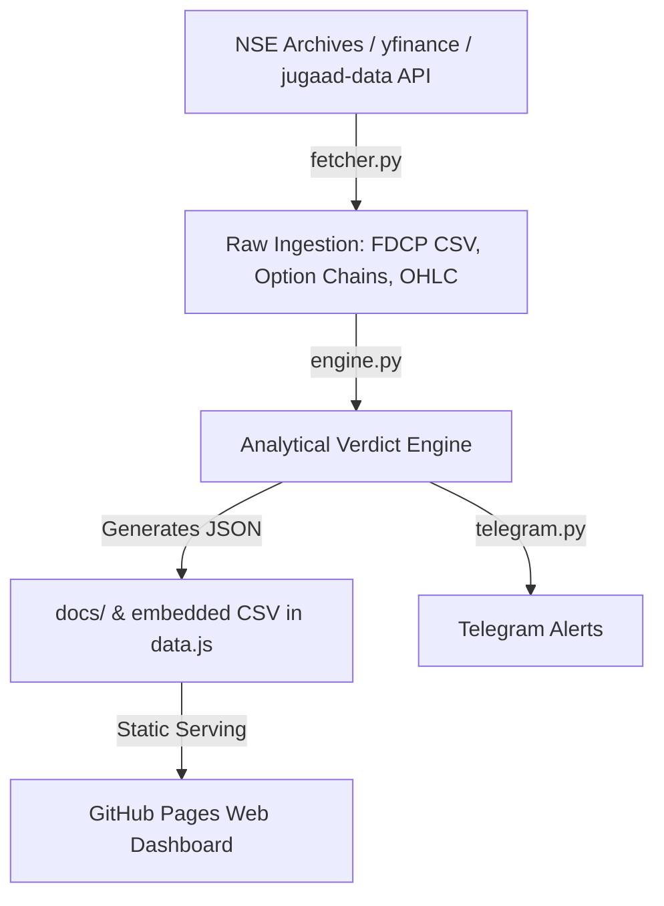

# Repository Guidelines

## Project Overview
**NFOD (NSE Financial Data Analytics / Option Chain Dashboard)** is a financial market analytics pipeline and web dashboard for Indian National Stock Exchange (NSE) market data. It ingests derivative positioning metrics (FII/DII/Pro/Client open interest), option-chain Implied Volatility (IV), and NIFTY OHLC, then computes institutional verdict scores (weighted FII/Pro/DII composite with retail-trap and IV modifiers) and publishes them as:

- A **static zero-dependency vanilla-JS dashboard** on GitHub Pages (3 views: Gross OI, Verdict, Charts).
- **Telegram alerts** replicating the Gross OI dashboard math (KPI cards, 6 instrument tables, takeaways).

The system is a two-stack design: a **Python 3.14 pipeline** (fetch → compute → output → notify) that writes JSON/CSV artifacts into the repo, and a **no-build vanilla frontend** that renders them.

---

## Architecture & Data Flow



### Pipeline (`main.py`), in exact phase order:
1. **fdcp** — `fetch_fdcp()` pulls participant OI CSVs from `https://archives.nseindia.com/content/nsccl/fao_participant_oi_{DDMMYYYY}.csv` incrementally: skips dates already in `FDCP_Data.csv`, walking back from today until it hits an existing date (caught up) or `days` (default 60) is exhausted. Appends new rows with dedup by `(Client Type, Date)`, then `update_embedded_csv()` rewrites the `_EMBEDDED_CSV` string inside `data.js`.
2. **oc** — `fetch_option_chain()` pulls full option-chain snapshots via `jugaad-data` (`NSELive.index_option_chain` / `NSELive.equities_option_chain`) into `docs/nse_data.json` + daily archives `docs/oc_history/YYYY-MM-DD.json` (30-day retention). **Engine-only data — the frontend never reads it.**
3. **ohlc** — `fetch_ohlc()` pulls `^NSEI` history via `yfinance`, appending only dates after the latest record in `docs/ohlc_data.json` (falls back to `OHLC_DAYS` window on cold start).
4. **engine** — `run_engine()` combines FDCP + option chain + history → `docs/money_flow_data.json`.
5. **telegram** — `send_gross_oi_telegram()` posts chunked HTML messages (≤4000 chars) to the Telegram Bot API.

### Frontend data flow:
- `data.js` embeds the FDCP CSV (`_EMBEDDED_CSV` → `parseCSV` → `rawCSVData`) and exposes cache-busted fetchers for `docs/money_flow_data.json` (`loadMoneyFlow`) and `docs/ohlc_data.json` (`loadOHLC`).
- `app.js` owns `NFOD.state` and routes among 3 views, each registered in `NFOD.views` with a `render(state)` contract.
- `views/gross.js` renders tables/KPIs from the CSV synchronously; Key Takeaways come from the **flat** `participant_summary` in `money_flow_data.json` (async append with a `renderSeq` stale-render guard).
- `views/verdict.js` renders entirely from the cached money-flow JSON.
- `views/charts.js` overlays NIFTY candles with participant call/put nets via ApexCharts CDN (repaired 2026-08-02; see Gotcha 1).

---

## Key Directories
- `nse_toolkit/` — Python backend: `config.py` (all constants), `fetcher.py` (all network I/O), `engine.py` (verdict math), `telegram.py` (alert builders/sender).
- `views/` — JS view components: `gross.js`, `verdict.js`, `charts.js`.
- `lib/` — JS utilities: `utils.js` (pure helpers), `sparkline.js` (inline SVG), `calendar.js` (date-picker popover).
- `docs/` — engine output artifacts: `money_flow_data.json`, `nse_data.json`, `ohlc_data.json`, `oc_history/` (daily archives), `superpowers/` (design spec + implementation plan).
- `test/` — browser smoke-test harness (`smoke.html`).
- `.github/workflows/` — the single CI/CD workflow.
- `favicon/` — PWA icons + `site.webmanifest` (manifest not currently linked from `index.html`).

---

## Development Commands

```bash
# Python pipeline (Python 3.14)
python main.py                 # all phases: fdcp → oc → ohlc → engine → telegram
python main.py fdcp|oc|ohlc|engine|telegram   # single phase
python main.py engine --dry-run               # engine diagnostics, writes nothing
python -m nse_toolkit.telegram                # standalone Telegram send

# Serve the dashboard locally
python -m http.server 8000    # then open http://localhost:8000

# Frontend QA
# Open test/smoke.html in a browser → console prints "RESULT: N pass, 0 fail"
```

There is **no build step, no package.json, no make targets**. CI runs `python main.py all` (workflow `data_update_and_deploy.yml`, cron `30 14 * * 1-5` = 8 PM IST Mon–Fri), commits outputs as "Update daily market data", and deploys the repo root to GitHub Pages.

---

## Code Conventions & Common Patterns

### Python
- **Types**: modern syntax throughout — `list[str]`, `dict | None` (`X | None`); `from typing import Optional` still used in `fetcher.py`.
- **Logging**: plain `print` with `[ENGINE]`/`[FDCP]`/`[OC]`/`[OHLC]`/`[TELEGRAM]` prefix tags; thread-safe `_log()` in fetcher. No `logging` module.
- **Error handling**: broad `except Exception` with graceful degradation — return `None`/`""`/`False` and continue (pipeline must not hard-fail on a missing/empty feed). Anti-bot detection: substring match on lowercased exception (`"blocked"`, `"403"`, `"too many"`, `"rate limit"`).
- **Concurrency**: `ThreadPoolExecutor` + `as_completed` for option-chain fetch only; a `threading.Event` pair (`session_blocked`/`session_reset`) coordinates anti-bot cooldown. **Thread-local `NSELive` instances** (`_thread_local` + `_get_nse_live()` in `fetcher.py`) avoid sharing jugaad-data sessions across threads — each worker bootstraps its own. On block, the first responder clears its stale session so the next call gets a fresh `NSELive`. FDCP/OHLC are sequential.
- **Naming**: `snake_case` functions, `SCREAMING_SNAKE` constants, docstrings on public functions. Double-quoted strings.
- **JSON encoding**: run everything through `config.clean_val()` before `json.dump` (converts numpy scalars, `NaN`→`None`, recurses).
- **Config**: every tunable (weights `FII 1.0 / PRO 0.6 / DII 0.4`, thresholds, IV bounds, ~210-symbol `ALL_FNO_STOCKS` static list) lives in `nse_toolkit/config.py` — never hardcode a new threshold elsewhere. `fetcher.py` `get_fno_symbols()` fetches the live F&O symbol list from NSE master-quote via jugaad-data's session, falling back to `ALL_FNO_STOCKS` on failure.
- **Dates**: dayfirst everywhere. FDCP dates `DD-MM-YYYY`; OC archives keyed `%Y-%m-%d` in **IST (UTC+5:30 hardcoded)** while `cleanup_old_history` compares UTC; expiry strings `DD-MMM-YYYY`.

### JavaScript
- **Namespace idiom**: every file starts `window.NFOD = window.NFOD || {};` and assigns a sub-namespace via IIFE (`NFOD.utils`, `NFOD.data`, `NFOD.views.gross/verdict/charts`, `NFOD.sparkline`). No ES modules, no bundler.
- **View contract**: each view exports `render(state)`; `app.js` calls `NFOD.views[activeView].render(NFOD.state)`. Views read `state.dateIndex` / `state.dates`.
- **Script load order is load-bearing** (`index.html`): `lib/utils.js` → `data.js` → `lib/sparkline.js` → `lib/calendar.js` → `views/gross.js` → `views/verdict.js` → `views/charts.js` → `app.js`. `data.js` calls `NFOD.utils.sortDatesChronological` at IIFE time, so utils must come first. Reordering breaks everything.
- **DOM**: template-literal HTML → `innerHTML`; async append via `insertAdjacentHTML("beforeend", ...)`; SVG via `document.createElementNS(...)`; events via direct `el.onclick = ...` and `addEventListener`.
- **Fetches**: wrapped in `try/catch`, return `null` on any failure, then render `<div class="error-card">` (verdict adds a Retry button → `NFOD.views.verdict.reset()`). URLs cache-busted with `NFOD.utils.cacheBust` (`?d=<day>`).
- **State**: one mutable `NFOD.state = { dateIndex, dates, activeView, theme }`; every change re-renders the active view. Verdict caches fetched JSON in a module closure.
- **Number formatting**: `NFOD.utils.formatIndianNum` (en-IN, `"-"` for null/undefined) everywhere; `toLocaleString("en-IN")` inline.
- **Theming**: design tokens in `:root` (`--surface-1/2/3`, `--text-1/2/3`, `--up: #34d399`, `--down: #f87171`, `--warn`, `--info`, `--accent`); dark default, `body.theme-light` overrides. New themable components must use tokens, not hardcoded colors. **Green/red semantics vary per column** — read the specific renderer (e.g. verdict colors `ce_trend_delta > 0` with `pos-down` because call-OI increase is bearish).

### Data & schema conventions
- **money_flow_data.json is dual-schema**: top-level `participant_summary` is **flat snake_case** (kept for `telegram.py` — do not remove/rename); nested `verdict`/`participants`/`retail`/`weights` are camelCase. Views bridge with `??` fallbacks (e.g. `ps.fii_ce_net_short_change ?? fii.options?.ce?.netShort`). Rename map from redesign: `index_rolls`→`rolls`, `stock_breadth`→`breadth`, `conviction_trends`→`conviction`, `flow_divergence`→`divergence`.
- **`score_history` (top-level, oldest→newest) powers the Verdict date nav**: one entry per FDCP date `{date, prev_date, score, bias, actionDesc, fiiRawScore, proRawScore, diiRawScore}`. Built by `build_score_history()` with `_score_date_pair()` (shared with `load_participant_data` — never re-implement scoring elsewhere). Historical entries use `iv_modifier=0` (no archived IV); the newest entry is stamped from the live `participant_summary` so banner and history always agree. `views/verdict.js` renders the banner from the selected date's entry and shows a "detail panels reflect latest snapshot" note for older dates.
- **Expiry proxy is last-Tuesday, not last Thursday** — `daysToMonthlyExpiry` (JS), `_days_to_monthly_expiry` (Python), and the calendar preset must stay in sync deliberately, even though it's not the real monthly expiry.
- **FDCP CSV headers carry trailing whitespace** (`"Future Stock Short       "`); every consumer must `df.columns.str.strip()` (Python) / trim (JS `parseCSV`). 5 rows per date: `Client, DII, FII, Pro, TOTAL` (views use the first four).

---

## Important Files
- `main.py` — CLI entry; `python main.py all` is what CI runs.
- `nse_toolkit/config.py` — all constants + `clean_val`/`sort_dates_chronologically`; imported by every module.
- `nse_toolkit/fetcher.py` — all network I/O; exports `fetch_fdcp` (incremental append), `fetch_option_chain` (jugaad-data NSELive, thread-local sessions, ThreadPoolExecutor + anti-bot Events), `fetch_ohlc` (incremental append), `update_embedded_csv`, `cleanup_old_history`, `get_fno_symbols`.
- `nse_toolkit/engine.py` — verdict engine: `run_engine`, `load_participant_data`, `compute_iv_modifier`, plus rolls/breadth/divergence/conviction analyses.
- `nse_toolkit/telegram.py` — Telegram alert builder/sender; reads `FDCP_Data.csv` for KPI cards + 6 instrument tables, and `docs/money_flow_data.json` (`participant_summary`) only for Key Takeaways. Mirrors `views/gross.js` math exactly.
- `index.html` — dashboard entry; defines the shell ids and the 8-script load order.
- `app.js` — state + tab routing + chrome (date nav, theme, menu, `?debug=1` logging).
- `data.js` — embedded `_EMBEDDED_CSV` + `NFOD.data` fetchers; the only place `docs/*.json` URLs are constructed.
- `views/gross.js`, `views/verdict.js`, `views/charts.js` — the three renderers.
- `lib/utils.js` — shared pure helpers; `lib/sparkline.js`, `lib/calendar.js` — components.
- `styles.css` — all theming/layout (605 lines, dark-first tokens, print stylesheet).
- `requirements.txt` — exact pins (below).
- `.github/workflows/data_update_and_deploy.yml` — the only CI workflow.

---

## Runtime/Tooling Preferences
- **Python**: 3.14 required; exact pins in `requirements.txt`: `pandas==3.0.5`, `requests==2.34.2`, `jugaad-data==0.35.1`, `yfinance==1.5.2`. `jugaad-data` is an **open-source PyPI package** providing `NSELive` for NSE's new website API — replaces the private `nsefetch` package. jugaad-data is **not thread-safe**; `fetcher.py` uses `threading.local()` for per-worker `NSELive` instances. Keep pins exact; no dev/test dependencies declared.
- **Frontend**: zero-dependency ES6 vanilla JS, classic `<script>` tags, no Node/Bun/npm/TypeScript/build step. Only external resources: Google Fonts (`Inter`, `JetBrains Mono`) and dynamically-injected unversioned ApexCharts CDN (`https://cdn.jsdelivr.net/npm/apexcharts`). Chart.js is **not** used.
- **Hosting**: GitHub Pages serving repo root; CI runs on `ubuntu-latest` with secrets `TELEGRAM_BOT_TOKEN`, `TELEGRAM_CHAT_ID`.
- **Git**: workflow uses `actions/checkout@v4`, `setup-python@v5`, `configure-pages@v4`, `upload-pages-artifact@v3`, `deploy-pages@v4`.

---

## Testing & QA
- **Framework**: none. QA is a manual browser harness, `test/smoke.html` — open it and read the console: `PASS`/`FAIL` lines plus `RESULT: N pass, M fail` (expected 8/8). **Not run in CI.**
- **Coverage**: CSV date count > 10, chronological date sort, `formatIndianNum` edges (`-180398` → `"-1,80,398"`, `null` → `"-"`), `clamp`, `monthlyExpirySuffix`, 4 participant keys, and 6 tables × 4 rows = 24 DOM rows in `.main-col .data-table tbody tr`.
- **Mechanics**: `eq(name, got, want)` uses `JSON.stringify` deep equality; loads real `lib/utils.js`, `data.js`, `lib/sparkline.js`, `views/gross.js`; deliberately **skips `app.js`** (its DOMContentLoaded would double-run) and sets `NFOD.state` manually — keep that state literal in sync with `app.js` defaults.
- **Python backend has no tests**; CI only exercises it by running `python main.py all` (which degrades gracefully rather than failing on empty feeds).

---

## Gotchas (read before editing)
1. **`views/charts.js` was repaired (2026-08-02)** — the old file failed to parse so the Charts tab silently no-oped. The live view now renders `NFOD.views.charts.render(state)`: ApexCharts candlestick + call/put line series on a uniform 1-day x-axis (`CHART_BASE` epoch origin), OHLC dates normalized to `DD-MM-YYYY`, charts destroyed and rebuilt on every re-render, and `ensureApex()` error-card fallback when the CDN is unreachable.
2. **`_EMBEDDED_CSV` boundary markers are contract**: `fetcher.py` `update_embedded_csv()` rewrites text between `var _EMBEDDED_CSV="` and `";let rawCSVData=` in `data.js`. Changing surrounding code or reformatting the blob (header says "Do not reformat") silently breaks regeneration; `date_count = len(data_lines) // 5` assumes 5 rows/date.
3. **Dead config**: `FDCP_WORKERS = 5` does nothing (FDCP fetch is sequential). `main.py --dry-run` duplicates engine scoring math inline — engine changes can drift it. `nsefetch` and its `OC_BREAKER_*` config constants have been removed (replaced by jugaad-data).
4. **Telegram mirrors the dashboard by design**: `telegram.py` reimplements the Gross OI math (KPI bias ±20000, instrument/participant names, last-Tuesday expiry). It must stay in sync with `views/gross.js` and `lib/utils.js`; changing one side desyncs alerts. `MAX_MSG = 4000` chunking.
5. **Timezone mix**: OC archive filenames use IST, history cleanup compares UTC, engine DTE uses naive local time. Be deliberate when touching date logic.
6. **`load_participant_data`/`run_engine` degrade to `None`/no-output** when `FDCP_Data.csv`/`nse_data.json` are missing — downstream treats that as empty output, not error.
7. **`index.html?debug=1`** enables `#debug-log` + window error logging; useful for verifying frontend changes without a dev server.
8. **Market-status widget removed (2026-08-02)** — `renderMarketStatus`/`istParts`/`marketStatus`, the `#market-status` element, `.status-pill`/`.status-clock` CSS, and `@keyframes pulse` were deleted; `app.js` no longer runs a ticking IST clock interval. The header now holds only the theme and menu buttons.
9. **`CLAUDE.md` (root) is legacy and partially stale** (claims CSV embeds into `app.js`, references old view ids, mentions Chart.js). The `docs/superpowers/` spec+plan are the accurate description of intended architecture. `AGENTS.md` supersedes CLAUDE.md where they conflict.
